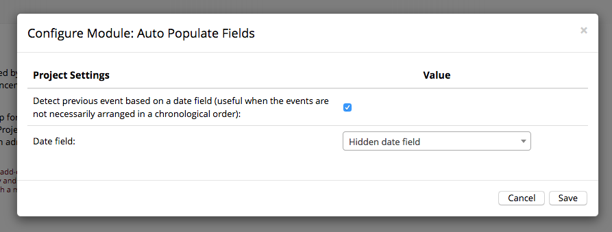

# REDCap Auto-Populate Fields

[](https://doi.org/10.5281/zenodo.3561116)

This REDCap module provides rich control of default values for data entry fields via a set of action tags. These action tags allow fields to be populated based on values from an ordered list of fields and static values. The fields can be read from the current event or the previous event in longitudinal projects.

## Prerequisites
- REDCap >= 8.0.0 (for versions < 8.0.0, [REDCap Modules](https://github.com/vanderbilt/redcap-external-modules) is required).

## Installation
- Clone this repo into to `<redcap-root>/modules/auto_populate_fields_v2.2`.
- Go to **Control Center > Manage External Modules** and enable Auto Populate Fields.
- For each project you want to use this module, go to the project home page, click on **Manage External Modules** link, and then enable Auto Populate Fields for that project.

## Features included

### Default when visible
By default, when a field that is hidden by branching logic contains a `@DEFAULT` action tag, an annoying alert is displayed on page load.
> ERASE CURRENT VALUE OF FIELD "<field_name>"?

This module changes the default branching logic behavior in order to avoid that. Now, when some non-empty field gets hidden by branching logic, no more warning messages are shown - instead, the hidden value persists available until form submission, when it is finally erased.

### Choice key piping on @DEFAULT
This module changes the display of selection fields when they are referenced in `@DEFAULT` action tags - instead of the label, the key is returned. Example: let's say we have a dropdown field called `animals`, whose options are:
```
1,Lion
2,Monkey
```
If we define somewhere `@DEFAULT="[animals]"`, the returned value will be `1` (instead of "Lion") or `2` (instead of "Monkey").


### New action tags
This module provides 2 new [action tags](https://wiki.chpc.utah.edu/pages/viewpage.action?pageId=595001400):

#### @DEFAULT_\<N\>
Provides the possibility to define secondary, tertiary, etc default values. If `@DEFAULT` returns an empty value, the next tag available - let's say `@DEFAULT_1` - is checked. If `@DEFAULT_1` returns empty, the next tag available - let's say `@DEFAULT_2` - is checked, and so on. This is useful when a fallback value is needed for piping (e.g. `@DEFAULT="[first_name]" @DEFAULT_1="Joe Doe"`).

#### @DEFAULT-FROM-PREVIOUS-EVENT
Sets a field's default value based on its own value in a previous event. To map the default value from another field, you may specify the source field name as a parameter to the action tag, e.g `@DEFAULT-FROM-PREVIOUS-EVENT="source_field"`. Analogously to `@DEFAULT_<N>`, `@DEFAULT-FROM-PREVIOUS-EVENT_<N>` is also provided.

If your events are not necessarily arranged in a chronological order, you can enable an option to auto-detect the last chronological event. To do that, go to your project page, then access External Modules (at the left sidebar), and then click on Auto Populate Fields configuration button:



### Mixing @DEFAULT_\<N\> and @DEFAULT-FROM-PREVIOUS-EVENT_\<N\>

When using `@DEFAULT_<N>` and `@DEFAULT-FROM-PREVIOUS-EVENT_<N>` together, using unique numbers on each action tag to ensure the desired precedence. E.g.

    @DEFAULT-FROM-PREVIOUS-EVENT_1='initial_dose'
    @DEFAULT-FROM-PREVIOUS-EVENT_2=intermediate_dose
    @DEFAULT-FROM-PREVIOUS-EVENT_3="final_dose"
    @DEFAULT_4="7"

In the above example `initial_dose` from the previous event will be used. Lacking that, `intermediate_dose` will be used. If none of `initial_dose`, `intermediate_dose`, and `final_dose` have been set, the value of 7 will be used.

Note that `@DEFAULT` is synonymous with `@DEFAULT_0`.  Similarly `@DEFAULT-FROM-PREVIOUS-EVENT` is synonymous with `@DEFAULT-FROM-PREVIOUS-EVENT_0`.

Note that the square brackets, `[]` common to REDCap piping are neither required nor supported in `@DEFAULT-FROM-PREVIOUS-EVENT` and `@DEFAULT-FROM-PREVIOUS-EVENT_<N>`. They _are_ required in `@DEFAULT_<N>` just like `@DEFAULT`.

## Considerations

Please note that when using **Enable chronological previous event detection**, deleting data from a form might change the expected behavior of auto-population. 

Though the data is erased, the null value written to the record is still a legitimate value that could be copied to next event filled in. This will only occur in new data entry if the last event in the sequence was deleted. Note that "sequence" here refers to chronological order.

For example, if data is keyed into the _wrong_ event and deleted, the data will not auto-populate when the correct event is opened. That said, if you open the correct event _before_ deleting the data from the wrong event, the data keyed into the wrong event will auto-populate into the correct event. 

## Example

An example project that demonstrates some of the features of this module is available in the [examples](examples/) folder.
