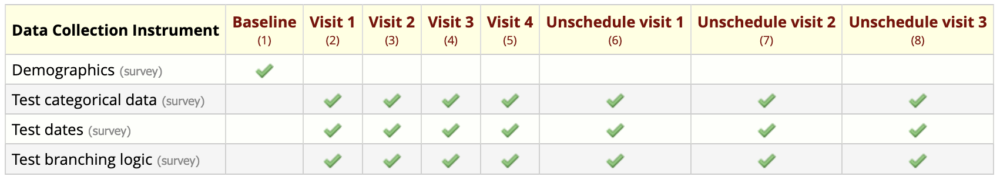

# Testing Auto-Populate Fields

Testing test REDCap Auto-Populate Fields can be simple or complex, depending on the feature you are testing. This document presents a few test you can run and describes resources you might use in those tests.

## Example Files

To simplify this process, an example project and testing data sets are provided in the [examples](./examples/) folder.

### test_project.xml

`test_project.xml` is a longitudinal project with 8 events and forms forms. Each form is enabled as a survey. There is data in the Baseline and Visit 1 events. Visits 2 and 3 and Unscheduled Visit 1-3 are all empty. The event matrix allows longitidunal collection for most forms

Each of the forms test_categorical_data, test_dates, and test_branching_logic use action tags from Auto-Populate Fields on some  of their fields. Most fields use the @DEFAULT-FROM-PREVIOUS-EVENT action tag. `birthday_mdy_from_ymd` copies it data from the `birthday_ymd` field on the previous event. `birthday_mdy_from_ymd_static` uses the `@DEFAULT_0` tag to set static value of '2019-06-29'.

The `choice_2` is hidden by branching logic that shows it only if choice_1 has a value of 1 on the same event. This can be used to copy data from a previous event and use it only if the target field is revealed by branching logic.

### visit_2_arm_1_data.csv

`visit_2_arm_1_data.csv` has data just for the visit 2 event

### unschedule_visit_1_arm_1_data.csv

`unschedule_visit_1_arm_1_data.csv` has data just for the Unscheduled Visit 1 event. It's data differs from the Visit 2 data.

## Tests

Consider running each of these tests described here to validate the module is behaving correctly. For each test, create a test project from the project XML file, then enable the the Auto-Populate Fields module.

### Test @DEFAULT-FROM-PREVIOUS-EVENT

To test the `@DEFAULT-FROM-PREVIOUS-EVENT` action tag, first test a field that uses it without naming another field.  Note a field that has that action tag, look at the last filled event on the form that has field, note or set a value for that field. Then open that form on the next event, the value from the previous event should be set on the new event.

Next, find a field (e.g., `birthday_mdy_from_ymd`) that uses `@DEFAULT-FROM-PREVIOUS-EVENT=some_field_name` . Note the value set of `some_field_name` on event N. On event N, open the form that has the field with `@DEFAULT-FROM-PREVIOUS-EVENT=some_field_name`. The value shoudl be pre-filled with the value for `some_field_name` on event N.

Test `@DEFAULT-FROM-PREVIOUS-EVENT` on a field hidden by branching logic (BL). Open the parent form on an event that has no data. The field hidden by BL should not be visible until its BL criteria are met. When that field appears, it should have the data from the previous event filled in. Breaking and remaking the BL criteria should hide and re-expose the prefilled field with each change. If the prefilled field is visible when the form is saved, that datum should be saved. Otherwise, the datum should not be saved.

Test `@DEFAULT-FROM-PREVIOUS-EVENT` with `Enable chronological previous event detection` enabled. In the module-level configuration, check `Enable chronological previous event detection`. Locate a field on Visit 2 that uses `@DEFAULT-FROM-PREVIOUS-EVENT`. Set the value on visit 2. On Unscheduled Visit 1, note that value from visit 2 being prefilled. Set a higher value on Unscheduled Visit 1. Open the form on visit 3. The field should pre-fill with the higher value from Unscheduled Visit 1. Set an even higher value. open Unscheduled Visit 2 and note the prefilled value. It should be highest value, the value from Visit 2.
